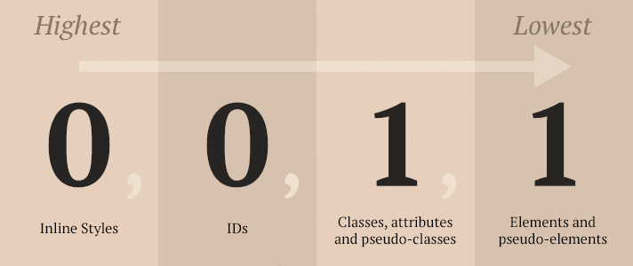

# Intro to CSS

## Content📣

- Approach with new material
- Writing semantic HTML
- Box model
- block level elements vs inline elements
- Box sizing: border-box (non-default)
- CSS Selector
- CSS Specificity
- Float
- Flexbox

## Approach 🆕❓

- 1️⃣ As the weeks progress there is lesser emphasis on giving you all the resources, functions, tips that you need to complete an activity
- 2️⃣ You're expected to research🔍 some subjects on your own
- 3️⃣ Focus is on plain vanilla CSS for now
- 4️⃣ CSS can be frustrating at first🙀

## New Project: Tweeter🐤

DEMO 📺

## CSS Box Model ⬜

- Every HTML element has a box around it 🔳
- 🔗[jsfiddle - box model](https://jsfiddle.net/dtremblay/nmLzpeo7/31/)
- 🔗[Interactive box-model demo](http://guyroutledge.github.io/box-model/)
- Box-sizing property

## Layout with Floats🔁

- Float is a CSS positioning property
- Initially used to wrap text around images
- Floats was being used for web layouts
- Element can be floated left or right
- Since the flow is changed, elements are not part of the normal flow
- The parent element contained floated elements can collapsed

- 🔗[Floats - jsFiddle](https://jsfiddle.net/dtremblay/493tjkaz/59/)

## Flexbox 💟

- A better way to layout elements

> The Flexbox Layout (Flexible Box) provides a more efficient way to lay out, align and distribute **space** among **items** in a **container**, even when their size is unknown and/or dynamic.

- A flex container expands items to fill available free space or shrinks them to prevent overflow.

- When working with flexbox you need to think in terms of two axes — the **main axis** and the **cross axis**. The main axis is defined by the `flex-direction` property, and the cross axis runs perpendicular to it.

- 🔗[Flexbox Layout Demo](https://jsfiddle.net/dtremblay/pozexhjb/2/)
- 🔗[Flexbox Exercise](https://jsfiddle.net/dtremblay/5ajL4zog/47/)
- 🔗[Reference Layout](https://cl.ly/053X3l0D3z2M/Image%202017-10-22%20at%201.16.28%20PM.png)
- 🔗[A Complete Guide to Flexbox](https://css-tricks.com/snippets/css/a-guide-to-flexbox/)

## CSS Selector

### Types of Selectors

- Basic Selector
- Class Selector
- ID Selector
- Attribute Selector
- Descendant Selector
- Sibling Selector

- 🔗[Selectors](https://jsfiddle.net/dtremblay/e3v095ws/149/)

## Understanding The Cascasde 💦

When 2 or more conflicting style rules target the same element, the browser has to decide which CSS styles to apply, iow which style will win! 🥇

### The Cascade (Simplified)

To determine the winning style, the browser will go through a cascade.

- 1️⃣ Selector Specificity - The more specific selector wins
- 2️⃣ Source Order - if the same specificity, the source order will matter

#### CSS Specificity

📏Specificity Rules

- The more specific selector gets applied
- A score is attributed to a selector

  - nb ids x 100 pts
  - nb classes x 10 pts
  - nb of elements x 1pt

* inline-style => 1000 pts

- 🔗[Selectors Specifity](https://jsfiddle.net/dtremblay/xr94uLnb/27/)

#### Source Order 🎢

- The last style overwrites any preceding conflicting rule that has the same specificity.
- It also depends on how the style was added

3 ways to add styles

- 1️⃣Inline
- 2️⃣Internal
- 3️⃣External